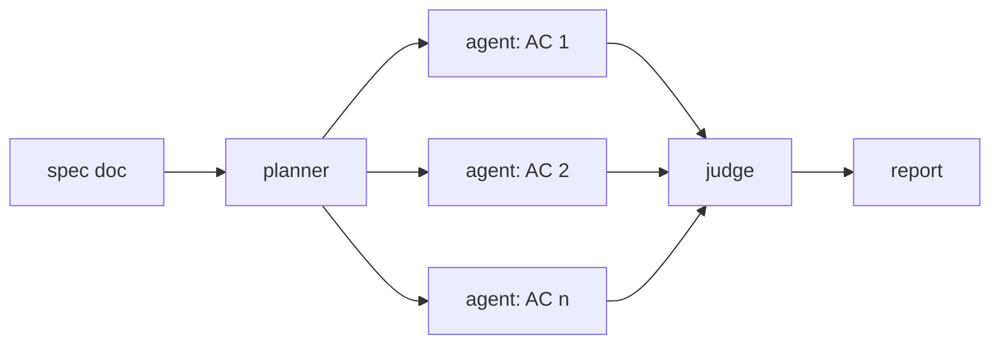

# opslane-verify

A verification layer for Claude Code. Reads your spec doc, runs one browser agent per acceptance criterion against your local dev server, and returns pass/fail with screenshots and video — before you push. No CI. No infrastructure.

## How it works



1. **Planner** — extracts testable acceptance criteria from your spec
2. **Agents** — one Claude + Playwright agent per AC, runs against your dev server
3. **Judge** — reviews screenshots and traces, returns pass/fail per AC
4. **Report** — prints results; failures include screenshot links and session recordings


## Installation

### Prerequisites

- Claude Code with OAuth login (`claude login`)
- Playwright MCP

### Install

```bash
/plugin marketplace add opslane/verify
/plugin install opslane-verify@opslane/verify
```

**macOS only:** `brew install coreutils` (for `gtimeout`)

## Usage

```bash
# One-time auth setup (skip if your app has no login)
/verify-setup

# Run verification
/verify docs/plans/my-feature.md
```

If you don't pass a spec path, `/verify` will ask you for one.

## Debugging failures

```bash
# View Playwright trace for a failed AC
npx playwright show-report .verify/evidence/<ac_id>/trace

# Watch session recording
open .verify/evidence/<ac_id>/session.webm
```
